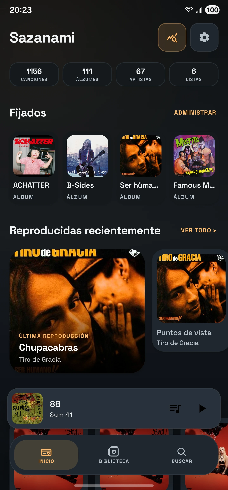
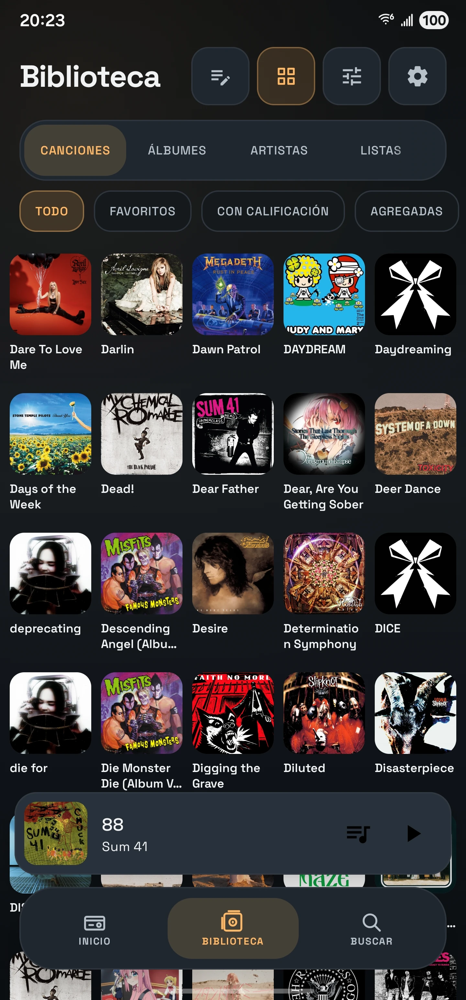
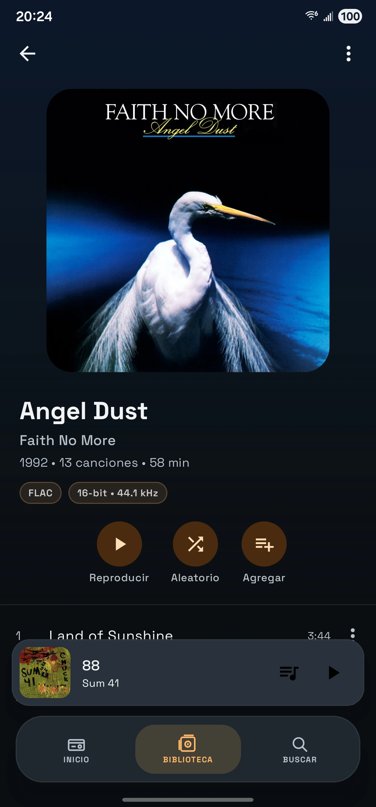
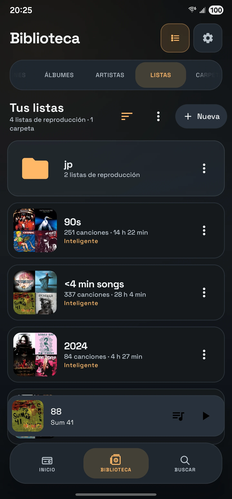

<p align="center">
  
</p>

<h1 align="center">Sazanami</h1>

<p align="center">
  <a href="README.md">English</a> | <strong>Español</strong>
</p>

<p align="center">
  <strong>Un reproductor de música para Android sin conexión, centrado en la privacidad y en tu propia biblioteca musical.</strong>
</p>

<p align="center">
  
  
  
</p>

<p align="center">
  <a href="https://github.com/rsgarrido/sazanami/releases/latest"><strong>Descargar el APK más reciente</strong></a>
  ·
  <a href="https://github.com/rsgarrido/sazanami/releases">Todas las versiones</a>
</p>

---

## Sazanami

Sazanami es un reproductor de música local para Android, pensado para quienes poseen y administran sus propios archivos de música.

Combina una biblioteca musical moderna con interfaces de reproducción muy personalizables, temas nostálgicos inspirados en equipos de audio, múltiples colas persistentes, listas inteligentes, edición directa de etiquetas en los archivos, estadísticas de escucha, letras locales, herramientas de audio, Android Auto y widgets para la pantalla de inicio.

Sazanami está diseñado en torno a la reproducción local y la privacidad. Tu biblioteca musical no requiere un servicio de streaming ni una cuenta, y Sazanami no rastrea ni vende tus datos de escucha.

## Características destacadas

- **Tu biblioteca musical local** — Explora canciones, álbumes, artistas, listas de reproducción, carpetas y géneros, con opciones de orden y filtrado, calificaciones, favoritos, búsqueda y vistas de música reproducida o agregada recientemente.
- **Seis experiencias de reproducción** — Elige entre el reproductor personalizable Predeterminado de Sazanami y cinco interfaces de inspiración retro. Guarda tu configuración del reproductor predeterminado como Mi reproductor.
- **Inglés y español** — Usa la aplicación en inglés o en español latinoamericano neutro, con una elección de idioma independiente del idioma de tu dispositivo.
- **Múltiples colas persistentes** — Crea y renombra colas de reproducción independientes, cambia entre ellas, consulta vistas previas y reordénalas sin perder tu posición.
- **Listas de reproducción manuales e inteligentes** — Crea listas tradicionales o colecciones basadas en reglas que usan metadatos, calificaciones, historial de escucha, fechas, conteos de reproducciones y más.
- **Edición directa de metadatos** — Edita las etiquetas y portadas compatibles directamente en tus archivos de música, en lugar de guardar metadatos solo dentro de la aplicación.
- **Herramientas avanzadas de audio** — Ecualización gráfica y paramétrica, ReplayGain, transición entre canciones, conservación de las transiciones del álbum, procesamiento de audio por hardware, navegación por la forma de onda y temporizador de apagado.
- **Estadísticas de escucha** — Explora el tiempo de escucha, los conteos de reproducciones, las tendencias y las canciones, artistas y álbumes más escuchados en intervalos de tiempo configurables.
- **Letras locales** — Usa tus propios archivos `.lrc` con reproducción sincronizada línea por línea.
- **Integración con Android** — Reproducción en segundo plano, controles en notificaciones y en la pantalla de bloqueo, botones de Bluetooth y multimedia, Android Auto y widgets de tamaño ajustable para la pantalla de inicio.
- **Copia de seguridad y restauración** — Exporta y restaura los datos compatibles de Sazanami, como la biblioteca, el historial, las calificaciones, las listas de reproducción, las preferencias y otros datos de la aplicación.

## Temas del reproductor

Sazanami incluye seis diseños de reproductor ampliado que comparten el mismo sistema de reproducción. Cada uno tiene su propio minirreproductor, interacciones, identidad visual y transición al reproductor completo.

<table>
  <tr>
    <td align="center" valign="top">
      <strong>Sazanami Default</strong><br><br>
      <br><br>
      Muy personalizable
    </td>
    <td align="center" valign="top">
      <strong>Classic Wheel</strong><br><br>
      <br><br>
      Interfaz de reproductor portátil con controles de rueda
    </td>
    <td align="center" valign="top">
      <strong>Retro Rack</strong><br><br>
      <br><br>
      Reproductor inspirado en equipos de rack, con espectro en tiempo real y cola
    </td>
  </tr>
  <tr>
    <td align="center" valign="top">
      <strong>Pocket Flip</strong><br><br>
      <br><br>
      Controles inspirados en dispositivos de mano y datos de la canción que reaccionan a la reproducción
    </td>
    <td align="center" valign="top">
      <strong>Pocket Cassette</strong><br><br>
      <br><br>
      Carretes, movimiento de cinta y controles de reproducción inspirados en casetes
    </td>
    <td align="center" valign="top">
      <strong>Pocket Disc</strong><br><br>
      <br><br>
      Diseño de reproductor digital portátil con indicadores de nivel que reaccionan al audio
    </td>
  </tr>
</table>

### Personaliza el reproductor predeterminado

El reproductor Predeterminado de Sazanami permite personalizar la disposición de la portada, los estilos de la barra de progreso, la densidad de la forma de onda, los fondos, los colores de progreso, la forma y el tamaño de la portada, los estilos de los controles, la alineación de los metadatos, la densidad del diseño y más.

Tu configuración personalizada se guarda como **Mi reproductor**, para que puedas volver a ella después de probar cualquiera de los cuatro estilos predefinidos incluidos.

Los temas retro también ofrecen sus propias combinaciones de colores configurables.

<p align="center">
  
</p>

Las transiciones del reproductor son interactivas, más allá de un simple cambio de pantalla. Al arrastrar, la portada y algunos elementos de la interfaz se desplazan entre el minirreproductor y el reproductor ampliado.

## Explora Sazanami

### Inicio y Biblioteca

Vuelve rápidamente a tu música fijada, las canciones reproducidas recientemente, la música agregada recientemente y tus favoritos desde Inicio. Luego explora y administra toda la biblioteca mediante Canciones, Álbumes, Artistas, Listas de reproducción, Carpetas y Géneros.

<p align="center">
  
  &nbsp;&nbsp;
  
</p>

### Álbumes y listas de reproducción

Las páginas de álbumes combinan una portada grande, metadatos del álbum, información técnica del audio, acciones de reproducción y la lista completa de canciones.

Las listas de reproducción manuales permiten personalizar el orden y la portada, mientras que las listas inteligentes pueden crear colecciones dinámicas a partir de reglas basadas en metadatos, calificaciones, historial de escucha, conteos de reproducciones, fechas y más.

<p align="center">
  
  &nbsp;&nbsp;
  
</p>

### Listas inteligentes

Crea reglas reutilizables, elige cómo ordenar las canciones que coinciden, limita opcionalmente la cantidad de resultados y consulta las coincidencias antes de guardar.

<p align="center">
  
</p>

### Múltiples colas

Sazanami no se limita a una sola cola de reproducción temporal.

Crea y nombra múltiples colas, consulta otra cola antes de cambiar a ella, reordena las próximas canciones y vuelve a una cola con su estado de reproducción conservado.

<p align="center">
  
</p>

### Estadísticas de escucha

Consulta tus hábitos de escucha en los intervalos Hoy, 7 días, 30 días, Este mes, Este año, Todo el tiempo o un intervalo personalizado.

Revisa el tiempo de escucha registrado, las reproducciones válidas, los conteos de reproducciones completas, las tendencias y tus canciones, artistas y álbumes más escuchados.

<p align="center">
  
  &nbsp;&nbsp;
  
</p>

### Ecualizador

Sazanami incluye modos de ecualización gráfica y paramétrica con preajustes, importación y exportación, preamplificación configurable, margen automático, análisis de respuesta y un limitador de picos de muestra opcional.

<p align="center">
  
</p>

### Edita tus archivos de música

Edita metadatos compatibles como el título, el artista, el álbum, el artista del álbum, la fecha o el año, el género, el compositor, el editor, los BPM, la información del disco, los comentarios, los derechos de autor y la portada.

Los cambios se escriben en los archivos de música compatibles, en lugar de existir solo dentro de Sazanami.

<p align="center">
  
</p>

### Widgets para la pantalla de inicio

Sazanami ofrece widgets de tamaño ajustable con controles de Anterior, Reproducir/Pausar y Siguiente.

La apariencia de los widgets puede seguir el tema actual del reproductor o usar los estilos Predeterminado de Sazanami, Sistema/Dinámico, Retro Rack, Pocket Cassette, Classic Wheel, Pocket Flip o Pocket Disc.

<p align="center">
  
</p>

## Privacidad y uso sin conexión

Sazanami está diseñado en torno a la música almacenada en tu dispositivo.

- No necesitas una cuenta de Sazanami.
- No necesitas una suscripción a un servicio de streaming.
- Tu historial de escucha y los datos de tu biblioteca se almacenan localmente.
- Sazanami no rastrea tu actividad de escucha con fines publicitarios ni vende tus datos de escucha.
- Las portadas, los metadatos, las letras, las listas de reproducción, las calificaciones, las colas y las estadísticas locales forman parte de la gestión de tu propia biblioteca.

Sazanami se centra intencionalmente en la música local que te pertenece, en lugar de convertir tu biblioteca en otro servicio en línea.

## Resumen de funciones

<details>
<summary><strong>Biblioteca y organización</strong></summary>

- Canciones, Álbumes, Artistas, Listas de reproducción, Carpetas y Géneros
- Vistas de lista y cuadrícula
- Orden y filtrado de la biblioteca
- Favoritos
- Calificaciones de 1–5 estrellas
- Agregadas recientemente
- Reproducidas recientemente
- Más reproducidas
- Búsqueda de canciones, álbumes, artistas y listas de reproducción
- Hasta cuatro elementos fijados en Inicio
- Imágenes personalizadas de artistas
- Portadas de listas de reproducción y collages automáticos
- Carpetas de listas de reproducción
- Importación de M3U y exportación de M3U8

</details>

<details>
<summary><strong>Reproducción y colas</strong></summary>

- Reproducción en segundo plano
- Anterior / Siguiente
- Reproducir / Pausar
- Reproducción aleatoria
- Repetición: Desactivada / Todo / Una
- Reproducir a continuación
- Agregar a la cola actual
- Agregar a otra cola
- Reproducir en una cola nueva
- Múltiples colas persistentes con nombre
- Reordenar la cola
- Restauración de la posición de reproducción
- Ir al álbum de la canción actual desde En reproducción en los temas del reproductor compatibles
- Transición entre canciones
- Conservación de las transiciones del álbum
- Inicio y pausa suaves
- ReplayGain
- Procesamiento de audio por hardware cuando es compatible
- Temporizador de apagado

</details>

<details>
<summary><strong>Listas de reproducción</strong></summary>

- Listas de reproducción manuales
- Listas inteligentes
- Reglas de listas inteligentes basadas en los hábitos de escucha, los metadatos y la información de la biblioteca y los archivos
- Coincidencia con todas las reglas o con cualquiera de ellas
- Campo de orden y dirección
- Límite opcional de canciones
- Vista previa de resultados en tiempo real
- Sugerencias de listas de reproducción generadas automáticamente
- Carpetas de listas de reproducción
- Orden personalizado en listas de reproducción manuales
- Portadas de listas de reproducción
- Importación de M3U
- Exportación de M3U8

</details>

<details>
<summary><strong>Audio y letras</strong></summary>

- Ecualizador gráfico
- Ecualizador paramétrico
- Preajustes del ecualizador
- Importación y exportación del ecualizador mediante texto o archivos
- Control de preamplificación
- Margen automático
- Limitador de picos de muestra
- Comparación A/B del ecualizador
- ReplayGain
- Navegación por la forma de onda
- Letras locales en archivos `.lrc`
- Letras sincronizadas línea por línea
- Búsqueda de letras en carpetas

</details>

<details>
<summary><strong>Personalización</strong></summary>

- Seis temas del reproductor
- Cuatro estilos predefinidos incluidos para el reproductor predeterminado
- Configuración personalizada guardada del reproductor predeterminado: Mi reproductor
- Apariencia de la aplicación: Sistema / Claro / Oscuro
- Idioma de la aplicación: Predeterminado del sistema / English / Español
- Múltiples estilos de transición de la portada
- Personalización de la barra de progreso y la forma de onda
- Tamaño, forma, ajuste y sombra de la portada
- Estilos de fondo y controles de desenfoque
- Estilos y tamaños de los controles de reproducción
- Alineación de metadatos y densidad del diseño
- Colores derivados del álbum
- Colores personalizados para los temas retro
- Fuente Sazanami / Space Grotesk
- Fuente predeterminada del dispositivo
- Minirreproductores que se adaptan al tema
- Transiciones del reproductor específicas de cada tema
- Múltiples estilos de widgets para la pantalla de inicio

</details>

<details>
<summary><strong>Historial de escucha y estadísticas</strong></summary>

- Registro del tiempo de escucha
- Conteos de reproducciones válidas
- Conteos de reproducciones completas
- Tendencias de escucha
- Canciones más escuchadas
- Artistas más escuchados
- Álbumes más escuchados
- Múltiples intervalos de fechas
- Intervalo de fechas personalizado
- Importación de Spotify Extended Streaming History
- Asociación manual entre el historial importado y las canciones locales

</details>

<details>
<summary><strong>Integración con Android</strong></summary>

- Notificación multimedia
- Controles en la pantalla de bloqueo
- Controles multimedia de Bluetooth y audífonos
- Servicio de reproducción Media3 en segundo plano
- Exploración y reproducción en Android Auto
- Widgets para la pantalla de inicio
- Restauración de la reproducción

</details>

## Descarga e instalación

### GitHub Releases

Los APK de las versiones estables de Sazanami se distribuyen mediante GitHub Releases.

**[Descargar la versión más reciente](https://github.com/rsgarrido/sazanami/releases/latest)**

Sazanami requiere **Android 8.0 (API 26) o posterior**.

Para instalar:

1. Descarga el APK más reciente de Sazanami desde GitHub Releases.
2. Abre el APK descargado en tu dispositivo Android.
3. Si Android lo solicita, permite que tu navegador o administrador de archivos instale aplicaciones desde esa fuente.
4. Instala Sazanami.
5. Abre la aplicación y permite el acceso a la música que quieres usar en Sazanami.

### Actualización

Instala el APK de una versión más reciente de Sazanami sobre la instalación existente.

Se recomienda hacer copias de seguridad antes de las actualizaciones importantes o al cambiar de dispositivo.

## Tecnología

Sazanami está escrito principalmente en **Kotlin** y usa **Jetpack Compose** y **Material 3** para su interfaz.

Sus principales tecnologías incluyen:

- **Media3 / ExoPlayer** — reproducción, integración con MediaSession, audio en segundo plano y Android Auto
- **Room** — listas de reproducción, historial de escucha, calificaciones, colas persistentes y otros datos estructurados de la aplicación
- **DataStore** — preferencias de la aplicación
- **Jetpack Glance** — widgets para la pantalla de inicio de Android
- **MediaStore y Storage Access Framework** — biblioteca local y acceso a archivos y carpetas seleccionados por el usuario
- **C++ / API multimedia de Android** — análisis de formas de onda sin conexión

Sazanami usa un `MediaLibraryService` para que la reproducción y los controles externos sean independientes de la interfaz principal de Compose.

## Compilación desde el código fuente

Clona el repositorio:

```bash
git clone https://github.com/rsgarrido/sazanami.git
cd sazanami
```

Abre el proyecto en Android Studio y permite que Gradle sincronice el proyecto.

Para una compilación local de depuración:

```bash
./gradlew assembleDebug
```

En Windows:

```powershell
.\gradlew.bat assembleDebug
```

## Documentación

Se agregará documentación técnica adicional en [`docs/`](docs/).

El repositorio también mantiene documentación interna sobre la arquitectura y el estado del proyecto, utilizada durante el desarrollo y las auditorías técnicas.

## Comentarios y problemas

Puedes reportar problemas, solicitar funciones y sugerir cambios mediante GitHub Issues. Usa las plantillas específicas para compartir los detalles:

- [Reportar un problema](https://github.com/rsgarrido/sazanami/issues/new?template=bug_report.md) — Describe el problema, los pasos para reproducirlo y las versiones de la aplicación y de Android.
- [Solicitar una función o sugerir un cambio](https://github.com/rsgarrido/sazanami/issues/new?template=feature_request.md) — Describe tu idea y cómo mejoraría Sazanami.

## Licencia

Sazanami se distribuye bajo la **GNU General Public License v3.0**.

Consulta [`LICENSE`](LICENSE) para ver el texto completo de la licencia.

Las fuentes incluidas y los recursos de terceros conservan sus respectivas licencias.

## Agradecimientos

Sazanami está desarrollado con tecnologías y bibliotecas de código abierto para Android, entre ellas Jetpack Compose, AndroidX Media3, Room, Glance, Coil y Jaudiotagger.

La fuente predeterminada de Sazanami es **Space Grotesk**, distribuida bajo la Open Font License.

Algunos diseños del reproductor se inspiran en el lenguaje visual de reproductores de música portátiles clásicos y reproductores multimedia de escritorio. Sazanami es un proyecto independiente y no está afiliado a los fabricantes ni a los desarrolladores de esos productos.
